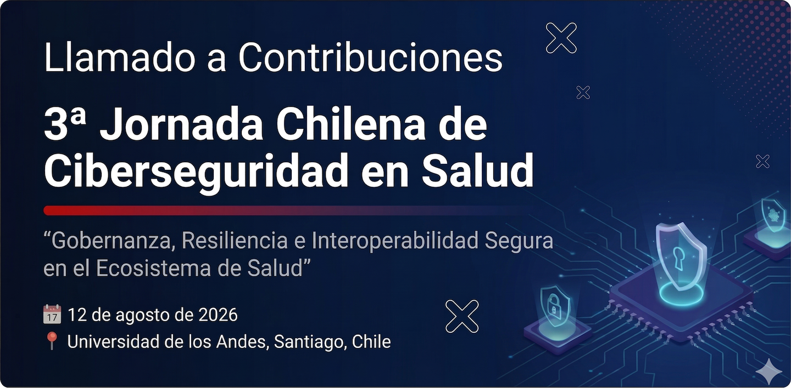

  

  <strong>Extendemos la fecha para envío de contribuciones hasta el 19 de junio.</strong> Revisa el <a href="#cronograma">cronograma actualizado</a>. Envía tus consultas a <a href="mailto:jccs.contacto@proton.me">jccs.contacto@proton.me</a>.

{{CFP_FORM_HERO_BUTTON}}

---

## 1. Introducción

En un contexto marcado por nuevas exigencias regulatorias, el fortalecimiento del marco nacional de ciberseguridad y el avance de la interoperabilidad en salud, las instituciones del ecosistema de salud enfrentan desafíos crecientes en protección de datos, continuidad asistencial y gobernanza digital.

La **3ª Jornada Chilena de Ciberseguridad en Salud** convoca a profesionales, investigadores y actores del ecosistema de salud a compartir experiencias, resultados de investigación y casos aplicados que contribuyan al desarrollo de capacidades en ciberseguridad en salud.

---

## 2. Objetivo del Llamado

Este llamado tiene como objetivo seleccionar contribuciones que aporten al debate técnico, clínico, organizacional y regulatorio en ciberseguridad en salud, promoviendo una visión multidisciplinaria y aplicada.

---

## 3. Tipos de Contribuciones

Se aceptan propuestas en dos modalidades:

### 🔹 Lightning Talks (presentaciones orales)
- Duración: 10 minutos
- Orientadas a trabajos con resultados relevantes, experiencias aplicadas o propuestas innovadoras

### 🔹 Posters
- Presentación visual durante el evento
- Orientados a trabajos en desarrollo, resultados preliminares o iniciativas institucionales

> El Comité Científico podrá sugerir la modalidad final de presentación.

---

## 4. Temáticas de Interés

Las contribuciones deben enmarcarse en uno o más de los siguientes ejes:

- Gobernanza y cumplimiento regulatorio en salud
- Resiliencia digital y continuidad asistencial
- Interoperabilidad segura de sistemas clínicos
- Protección de datos personales en salud
- Uso secundario de información en salud
- Inteligencia artificial y ciberseguridad en salud

---

## 5. Público Objetivo

Podrán postular:

- Profesionales del sector salud (clínico o gestión)
- Equipos de tecnologías de la información
- Responsables de ciberseguridad, privacidad o compliance
- Investigadores en salud digital o ciberseguridad
- Estudiantes de postgrado
- Tesistas de pregrado
- Profesionales de la industria tecnológica

---

## 6. Requisitos de Postulación

Las propuestas deberán enviarse mediante formulario online e incluir:

- Título del trabajo  
- Autor(es) y afiliación institucional  
- Modalidad propuesta (oral o poster)  
- Área temática  

### Resumen (300–500 palabras), que incluya:
- Introducción / contexto  
- Objetivo(s)  
- Metodología  
- Resultados (o resultados esperados)  
- Conclusiones / implicancias  

---

## 7. Criterios de Evaluación

Las propuestas serán evaluadas por el Comité Científico considerando:

- Relevancia para el contexto del ecosistema de salud chileno  
- Aplicabilidad práctica  
- Rigor metodológico  
- Originalidad  
- Claridad de la propuesta  

---

<h2 id="cronograma">8. Fechas Importantes</h2>

- Apertura del llamado: lunes 13 de abril
- Cierre de postulaciones: viernes 19 de junio  
- Notificación de resultados: lunes 13 de julio
- Evento: **miércoles 12 de agosto de 2026**

---

## 9. Comité Científico

El Comité Científico estará compuesto por especialistas de distintas áreas, incluyendo:

- Derecho digital y protección de datos  
- Ciberseguridad técnica  
- Gestión clínica  
- Gobernanza y gestión de riesgos  
- Investigación en salud digital  

Su objetivo es garantizar rigor técnico, relevancia sectorial y diversidad de perspectivas.

---

## 10. Envío de Propuestas

{{CFP_FORM_SECTION}}

---

## 11. Contacto

{{CONTACT_EMAIL_TEXT}}

La política de privacidad del evento está disponible en [Política de Ciberseguridad, Privacidad y Protección de Datos](../privacy/).

---
